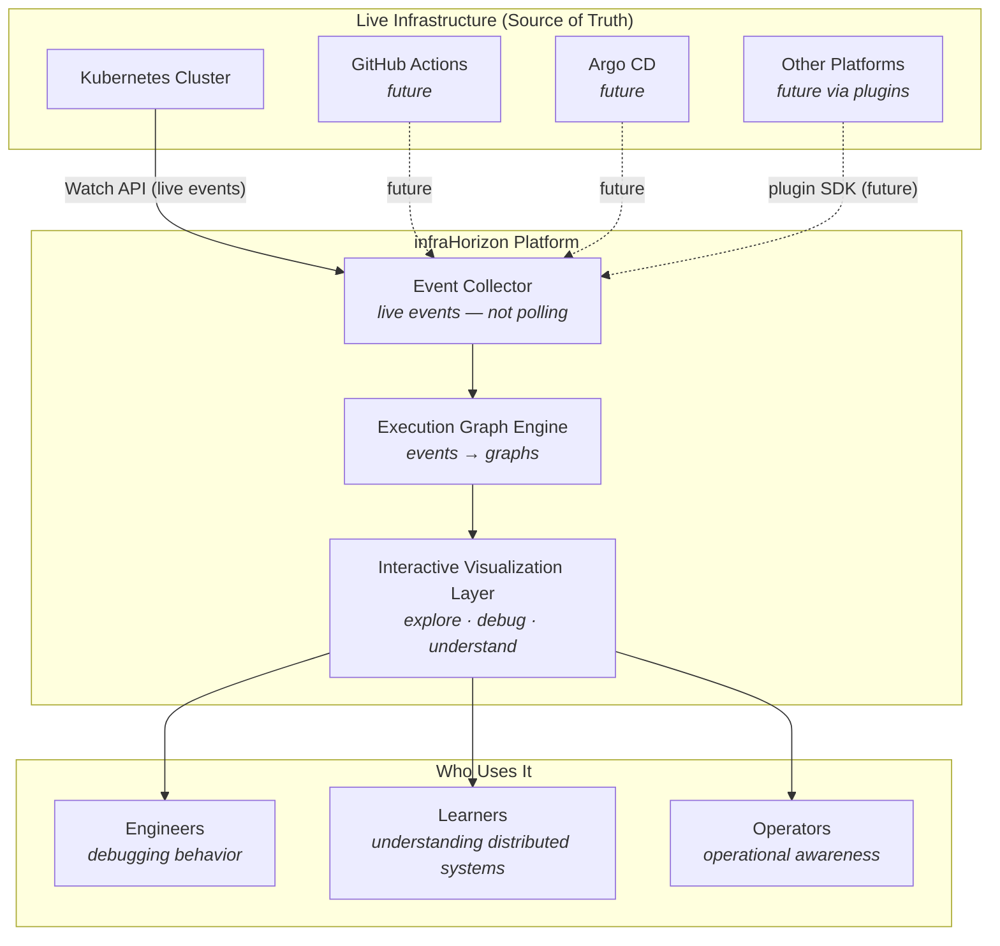
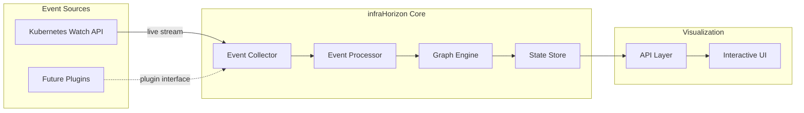
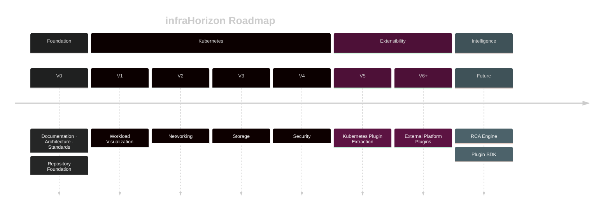
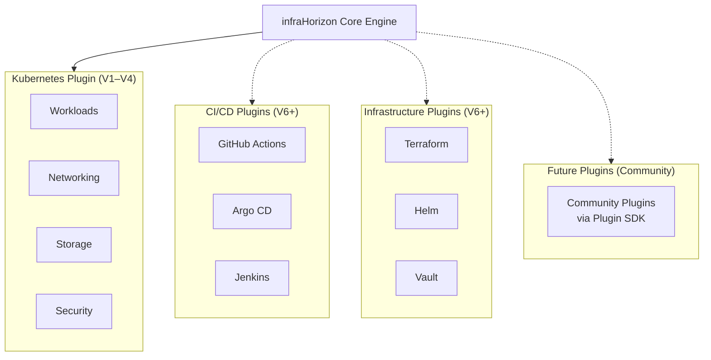
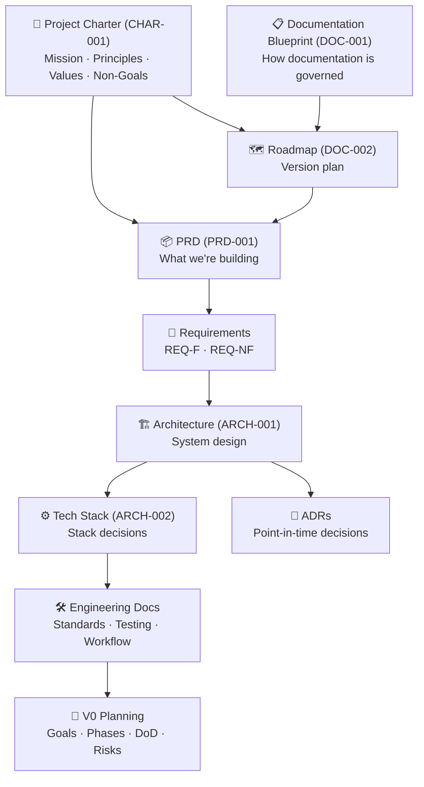

<h1 align="center">infraHorizon</h1>

<p align="center">
  <em>Transform live infrastructure behavior into interactive execution graphs.</em>
</p>

<p align="center">
  
  
  
  
</p>

---

## What Is infraHorizon?

infraHorizon is an open-source, event-driven visualization platform that transforms live infrastructure behavior into **interactive execution graphs** — making distributed systems understandable for engineers, learners, and operators.

It is **not** a Kubernetes dashboard. It is **not** a monitoring tool. It is a platform for *understanding* — connecting to real systems, consuming live events, and converting that behavior into something a human can explore and reason about.

The first supported platform is Kubernetes. Future platforms are supported via a plugin architecture.

---

## Vision



> **Solid lines** = V1 scope (Kubernetes). **Dashed lines** = future roadmap via plugin architecture.

---

## Motivation

Modern distributed systems are complex. Kubernetes alone has dozens of resource types, multiple controllers, and an event loop that is nearly impossible to reason about from logs alone.

Most existing tools answer *"what is the current state?"* infraHorizon answers *"what actually happened, and why?"*

By consuming live events and constructing execution graphs in real time, infraHorizon turns invisible infrastructure behavior into something you can see, explore, and understand — regardless of whether you built the system.

---

## Architecture Overview



> Architecture details are in `docs/architecture/overview.md` (ARCH-001). Technology stack decisions are captured in `docs/architecture/adr/`.

**Key design decisions:**
- **Event-driven, not polling.** Infrastructure events are consumed as they happen via the Kubernetes Watch API.
- **Graph-first.** Every event is modeled as a node or edge in an execution graph, not a log entry.
- **Plugin-ready.** The architecture allows future platform integrations without changing the core.
- **Real systems only.** No simulation, no mock data in production.

---

## Roadmap



**Current version:** V0 — Foundation. Building the stable base that all future versions depend on.

Only V0 is being actively designed and built. Future versions are roadmap placeholders.

---

## Plugin Ecosystem (Future)



> **Solid lines** = planned. **Dashed lines** = future community-extensible via Plugin SDK.

The plugin architecture means any platform that emits events can eventually be visualized by infraHorizon without changes to the core engine.

---

## Documentation Structure



All documentation lives in `docs/`. The Documentation Architecture Blueprint (`DOC-001`) governs how all documents are created, owned, and reviewed.

---

## Repository Layout

```
infraHorizon/
├── README.md                    # This file
├── CONTRIBUTING.md              # How to contribute
├── CODE_OF_CONDUCT.md           # Community standards
├── SECURITY.md                  # Security policy
├── KNOWLEDGE_BASE.md            # Project canonical context
├── LICENSE                      # (pending)
│
└── docs/
    ├── README.md                # Documentation map
    ├── charter.md               # CHAR-001 — Project constitution (pending)
    ├── documentation-architecture-blueprint.md  # DOC-001 — Governance
    ├── roadmap.md               # DOC-002 — Version roadmap (pending)
    ├── decision-log.md          # Chronological decision log
    ├── contributor-reference.md # Current state + onboarding
    │
    ├── product/
    │   ├── prd.md               # PRD-001 (pending)
    │   └── requirements/
    │       ├── functional-requirements.md   (pending)
    │       └── non-functional-requirements.md (pending)
    │
    ├── architecture/
    │   ├── overview.md          # ARCH-001 (pending)
    │   ├── tech-stack.md        # ARCH-002 (pending)
    │   └── adr/
    │       └── README.md        # ADR index (pending)
    │
    ├── engineering/
    │   ├── coding-standards.md  # ENG-001 (pending)
    │   ├── testing-strategy.md  # ENG-002 (pending)
    │   └── development-workflow.md # ENG-003 (pending)
    │
    └── planning/
        └── v0/
            ├── goals.md         # PLAN-001 (pending)
            ├── phases.md        # PLAN-002 (pending)
            ├── definition-of-done.md # PLAN-003 (pending)
            └── risk-register.md # PLAN-004 (pending)
```

---

## Contributing

We welcome contributions from engineers, learners, and anyone who wants to make distributed systems more understandable.

**Quick start:**
1. Read `KNOWLEDGE_BASE.md`
2. Read `CONTRIBUTING.md`
3. Browse [`good first issue`](https://github.com/infraHorizon/infraHorizon/labels/good%20first%20issue) labels
4. Comment on an issue to claim it

**Important:** This project follows a documentation-first approach. Architecture and documentation are approved before implementation begins. Please read `CONTRIBUTING.md` before opening a PR.

---

## Current Status

**Version 0 — Foundation** is actively in progress.

We are building the documentation and architectural foundation that all future versions depend on. V0 does not include Kubernetes visualization or any runtime implementation — it establishes the stable base.

See `docs/contributor-reference.md` for the current state and what's actively being worked on.

---

## License

License to be decided as part of V0. See `docs/` for the decision log.

---

## Community

This project optimizes for **learning and collaboration**. We value clear explanations, educational PRs, and contributors at all experience levels.

- Read the [Code of Conduct](CODE_OF_CONDUCT.md)
- Review the [Security Policy](SECURITY.md)
- Explore [open issues](https://github.com/infraHorizon/infraHorizon/issues)
