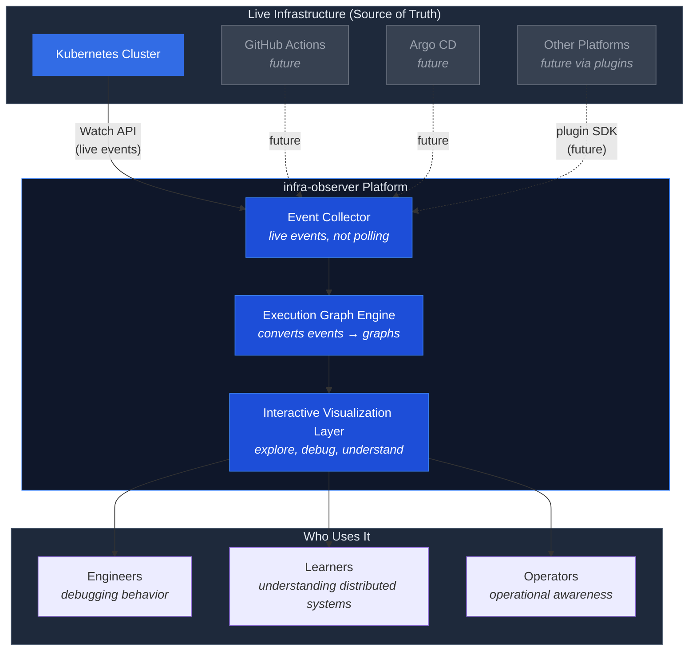

# infraHorizon — Documentation

> The long-term vision is an interactive visualization platform that transforms live infrastructure behavior into interactive execution graphs for learning, debugging, and operational understanding.

---

## What Is infraHorizon?

**Solid lines** = V0 scope (Kubernetes, live events via Watch API).
**Dashed lines** = future roadmap items via plugin architecture.

This is **not** a Kubernetes dashboard, replacement, or simulator. It is a platform for making distributed system behavior *understandable*.

---

## Documentation Map

| Document | ID | Description |
|----------|----|-------------|
| [Documentation Architecture Blueprint](documentation-architecture-blueprint.md) | `DOC-001` | How all documentation is governed — the meta-layer. Start here to understand how this repo is organized. |
| `charter.md` *(pending)* | `CHAR-001` | Project constitution — mission, principles, values, non-goals. |
| `roadmap.md` *(pending)* | `DOC-002` | Version roadmap — where the project is going. |
| `product/prd.md` *(pending)* | `PRD-001` | Product Requirements Document — what V0 builds and why. |
| `product/requirements/` *(pending)* | `REQ-F/NF` | Functional and non-functional requirements. |
| `architecture/overview.md` *(pending)* | `ARCH-001` | High-level system architecture. |
| `architecture/tech-stack.md` *(pending)* | `ARCH-002` | Technology stack proposals and decision. |
| `architecture/adr/` *(pending)* | `ADR-NNN` | Architecture Decision Records. |
| `engineering/` *(pending)* | `ENG-001…` | Coding standards, testing strategy, development workflow. |
| `planning/v0/` *(pending)* | `PLAN-001…` | V0 goals, phases, Definition of Done, risk register. |

Documents marked *(pending)* are planned per the [execution plan](../.claude/v0-documentation-execution-plan.md) and will be added as Version 0 progresses.

---

## Where to Start

- **Understand the project rules →** [Documentation Architecture Blueprint](documentation-architecture-blueprint.md)
- **Understand what we're building →** `charter.md` *(coming next)*
- **Understand V0 scope →** `product/prd.md` *(coming after charter)*
