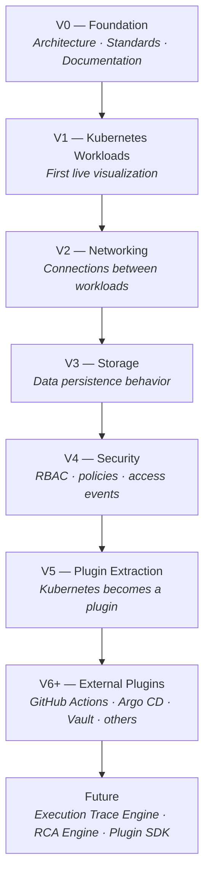
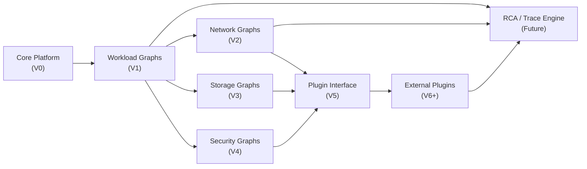
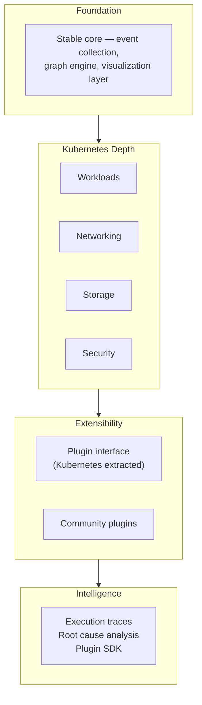

# Roadmap

> **ID:** DOC-002
> **Version:** 0.1
> **Status:** In Review
> **Owner:** Product Manager
> **Approver:** Project Owner
> **Last Updated:** 2026-07-14

---

## Foundation

This roadmap derives directly from the Project Charter (CHAR-001).

Every version described here exists because it moves infraHorizon toward its mission: to make distributed system behavior understandable by transforming live infrastructure events into interactive execution graphs.

The Charter Rule applies to this document and to everything it spawns:

> *Every roadmap item must answer — "Does this move the project toward the mission?" If not, it does not belong here.*

This is a **product roadmap**, not a project schedule. It describes *what* infraHorizon becomes across versions and *why* each step follows the previous one. It contains no dates, no effort estimates, and no implementation details. Those belong in version-specific planning documents.

---

## Version Progression

---

## Capability Dependencies

---

## Product Evolution

---

## Versions

### V0 — Foundation

**Capability introduced:** A stable, documented, and well-governed architectural foundation — not yet a running product, but the platform everything else is built on.

**Why this version exists:** No meaningful feature can be built on an unclear foundation. V0 establishes the architecture, engineering standards, documentation system, and development workflow that every future version depends on. Getting this right is more valuable than getting started fast.

**Why it must come before V1:** V1 requires a proven event collection pipeline, a graph engine capable of accepting Kubernetes events, and a visualization layer ready to render the result. None of those can be built correctly without an agreed architecture. V0 produces that agreement.

**Foundation created:** A complete, reviewable system architecture. A chosen technology stack. Documented coding standards and testing strategy. A functioning development environment. The infrastructure for everything that follows.

---

### V1 — Kubernetes Workload Visualization

**Capability introduced:** The first live visualization. Engineers can connect infraHorizon to a real Kubernetes cluster and observe workload behavior — Pod scheduling, Deployment rollouts, ReplicaSet scaling, Job execution — as interactive execution graphs in real time.

**Why this version exists:** Workloads are the most visible part of Kubernetes. They are what engineers deploy, what fails under load, and what learners encounter first. Making workload behavior visible and explorable is the first concrete realization of the mission — it is where infraHorizon becomes a real tool rather than a documented idea.

**Why it must come before V2:** Networking behavior in Kubernetes only makes sense in the context of the workloads communicating. A network graph without workload context is uninterpretable. V1 establishes the conceptual vocabulary — Pods, Deployments, Services — that networking events refer to.

**Foundation created:** A working event collection pipeline connected to the Kubernetes Watch API. A graph model capable of representing workload relationships and state transitions. A visualization layer that renders live execution graphs. The pattern that all subsequent Kubernetes versions follow.

---

### V2 — Networking Visualization

**Capability introduced:** The connections between workloads become visible. Traffic flows, Service routing, DNS resolution, NetworkPolicy enforcement, and Ingress behavior are added to the execution graph — showing not just what workloads exist, but how they communicate.

**Why this version exists:** Most distributed system failures are not workload failures — they are communication failures. A Pod is healthy but unreachable. A Service routes to the wrong endpoint. A NetworkPolicy silently drops traffic. These failures are invisible without network visibility. V2 makes the invisible visible.

**Why it must come before V3:** Persistent storage in Kubernetes is almost always accessed *by* workloads *over* the network. Understanding storage behavior requires understanding which workload is accessing what, and through what path. V3 builds on both the workload context of V1 and the communication context of V2.

**Foundation created:** A graph model that captures both entities (workloads) and relationships (connections). An enriched event model that includes network-level events. The conceptual pairing of "what is running" with "how it is connected" that underlies all subsequent work.

---

### V3 — Storage Visualization

**Capability introduced:** Data persistence behavior becomes part of the execution graph. PersistentVolume provisioning, PVC binding, volume mount events, and storage class behavior are visualized alongside the workloads and network paths they involve.

**Why this version exists:** Stateful behavior is one of the hardest aspects of distributed systems to reason about. When a database Pod restarts, what happens to its data? When a PVC fails to bind, which workload is blocked and why? V3 answers these questions by completing the picture of what a running system actually does with its data.

**Why it must come before V4:** Security events in Kubernetes frequently involve storage — secrets mounted as volumes, ServiceAccount tokens, ConfigMap access. Understanding security behavior requires the full context of what is running, how it communicates, and what data it accesses. V4 is interpretable only with V1–V3 in place.

**Foundation created:** A complete operational graph that captures compute, network, and storage as a unified view of infrastructure behavior. The conceptual model that V4 and beyond extend.

---

### V4 — Security Visualization

**Capability introduced:** Security-relevant events are surfaced in the execution graph. RBAC decisions, ServiceAccount usage, Secret access, NetworkPolicy enforcement outcomes, and admission controller events become visible and explorable.

**Why this version exists:** Security behavior in Kubernetes is notoriously opaque. Permissions are granted across many layers. Access decisions are logged but rarely visualized in context. V4 makes the security posture of a running cluster observable — who accessed what, when, and whether it was permitted — using the same execution graph model as every other version.

**Why it must come before V5:** V5 extracts the Kubernetes integration into a self-contained plugin. To do that correctly, the plugin must carry the full scope of what Kubernetes observation means — workloads, networking, storage, and security. A plugin extracted before V4 would be incomplete and would need to be redesigned when security was added later.

**Foundation created:** A complete Kubernetes observation model covering all four major behavioral domains. A proven platform capable of handling the full complexity of a production cluster. A codebase ready to be packaged into a plugin.

---

### V5 — Kubernetes Plugin Extraction

**Capability introduced:** The Kubernetes integration, which has been built directly into the core platform through V1–V4, is refactored into a self-contained, well-defined plugin. The core platform and the Kubernetes plugin become two separate, independently versioned components connected by a stable plugin interface.

**Why this version exists:** Every future platform integration depends on a plugin interface that actually works. The only way to design that interface correctly is to extract a real, complex integration — one that has already been built and battle-tested — and define the interface by what it actually needs. V5 is not a feature; it is a structural evolution that makes V6+ possible.

**Why it must come before V6+:** You cannot design a good abstraction before you have a concrete implementation to abstract. V1–V4 produce a complete, real Kubernetes integration. V5 turns that integration into the reference implementation and the template for every plugin that follows.

**Foundation created:** A stable, documented plugin interface. A reference plugin (Kubernetes) that demonstrates how any platform can be integrated. A core platform that knows nothing about Kubernetes — only about receiving events and building graphs.

---

### V6+ — External Platform Plugins

**Capability introduced:** Platforms beyond Kubernetes can be connected to infraHorizon through the plugin interface established in V5. The initial set includes CI/CD platforms (GitHub Actions, Argo CD, Jenkins), infrastructure tools (Helm, Terraform, Vault), and machine learning orchestration (Kubeflow). Each plugin brings its platform's behavior into the same execution graph model.

**Why this version exists:** The mission is not to understand Kubernetes — it is to understand distributed system behavior. Kubernetes is where the project begins; it is not where it ends. V6+ is where infraHorizon becomes a platform rather than a Kubernetes tool, and where the plugin architecture justifies its existence.

**Why it must come before the future intelligence layer:** The RCA Engine and Execution Trace Engine derive their value from cross-platform correlation — tracing a failure from a GitHub Actions workflow through a Helm deployment into a Kubernetes cluster. That correlation requires multiple platform plugins to exist and produce events in a compatible format. The intelligence layer interprets what the platform layer collects.

**Foundation created:** A growing ecosystem of platform plugins. Cross-platform event correlation. A community model for contributing new platform integrations.

---

### Future — Intelligence Layer

**Capability introduced:** Cross-platform intelligence built on top of the execution graph. The Execution Trace Engine reconstructs the full causal chain of a distributed event across multiple platforms and versions. The Root Cause Analysis (RCA) Engine identifies why something failed and traces the failure to its origin. The Plugin SDK formalizes the plugin interface into a published, versioned contract that enables community-built integrations.

**Why this will exist:** Once events from multiple platforms are flowing into a unified graph model, the question shifts from *"what happened?"* to *"why did it happen, and how do I prevent it?"* The intelligence layer is where observation becomes insight — where infraHorizon moves from a visualization tool to a reasoning tool. The Plugin SDK ensures this ecosystem grows beyond what the core team can build.

**What makes it possible:** Everything that came before. The intelligence layer is not a standalone capability — it is the emergent value of a complete, multi-platform, event-driven graph platform. It cannot be built until the foundation is solid, the Kubernetes model is proven, and the plugin ecosystem is real.

---

## What This Roadmap Is Not

This roadmap does not specify how any version is built. Technology choices, architecture decisions, sprint plans, and feature lists belong in version-specific documents — the PRD, Requirements, Architecture Overview, and ADRs for each version.

This roadmap answers one question per version: *why does this exist, and why now?* Everything else is downstream.
